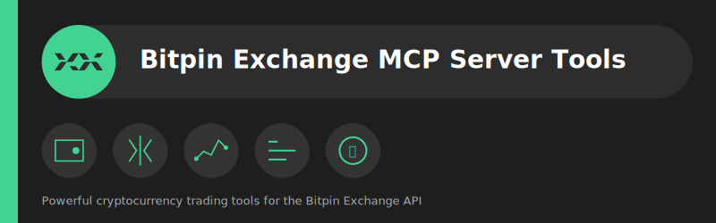

This repository provides an MCP server implementation for the Bitpin cryptocurrency exchange. The server exposes several tools for interacting with the Bitpin API, such as retrieving wallet balances, market data, order details, and executing various types of orders like limit orders, market orders, stop-limit orders, and OCO (One Cancels the Other) orders.

## 📺 Demo

Check out a live demo of the Bitpin MCP Server in action, showcasing LLM-powered crypto trading:

[](https://youtu.be/km_kjTRsrf8)

## Features

The MCP server provides the following tools:

- **GetWalletsListAsync**: Retrieve a list of wallet balances for various cryptocurrencies.
- **GetMarketsListAsync**: Retrieve a list of all supported trading markets.
- **GetTickersListAsync**: Retrieve the current price list of Bitpin's markets.
- **GetCurrenciesAsync**: Retrieve a list of supported cryptocurrencies with details such as symbol, name, and tradability status.
- **GetOrderbooksAsync**: Retrieve the open orders in a specific trading market.
- **GetMatchesAsync**: Retrieve the latest executed trades for a specific market.
- **CreateLimitOrderAsync**: Place a limit order to buy or sell a cryptocurrency at a specified price.
- **CreateMarketOrderAsync**: Place a market order to instantly buy or sell at the best available price.
- **CreateStopLimitOrderAsync**: Place a stop-limit order to buy or sell once a specific stop price is reached.
- **CreateOcoOrderAsync**: Place an OCO (One Cancels the Other) order to manage both limit and stop-limit orders simultaneously.
- **GetOrdersAsync**: Retrieve your list of orders.
- **GetCompeletedOrdersAsync**: Retrieve details of your completed orders (executed trades).
- **GetOrderByIdAsync**: Retrieve a specific order by its order ID.
- **CancelOrderByIdAsync**: Cancel a specific order by its order ID.

## Prerequisites

- .NET 9 or higher
- The `BitpinClient` NuGet package
- Access to the Bitpin API (API Key and Secret)

## Setting Up the Server

1. **Install Dependencies**  
   Ensure that your project references the required `BitpinClient` package and all necessary dependencies for MCP server tools.

2. **Configure Bitpin API Settings**  
   Set up your API Key and Secret for the Bitpin API in the `BitpinClientSettings`:

   ```csharp
   var settings = new BitpinClientSettings()
   {
       Key = "****",  // Replace with your Bitpin API Key
       Secret = "****",  // Replace with your Bitpin API Secret
   };
   ```

3. **MCP Server Configuration**  
   Add the MCP server configuration to your application settings:

   ```json
   {
       "mcpServers": {
           "BitpinExchange": {
               "command": "dotnet",
               "args": [
                   "run",
                   "--project",
                   "D:\\projects\\bitpin-mcp-server\\src\\MCPServer\\MCPServer.csproj",
                   "--no-build"
               ]
           }
       }
   }
   ```

4. **Configure Services in `Program.cs`**

   Use the following configuration to add the `BitpinClient` service and set up the MCP server:

   ```csharp
   using BitpinClient;
   using Microsoft.Extensions.DependencyInjection;
   using Microsoft.Extensions.Hosting;

   var builder = Host.CreateEmptyApplicationBuilder(settings: null);

   var settings = new BitpinClientSettings()
   {
       Key = "****", // Replace with your API Key
       Secret = "****", // Replace with your API Secret
   };

   builder.Services.AddBitpinClient(settings);
   
   builder.Services.AddMcpServer()
       .WithStdioServerTransport()
       .WithToolsFromAssembly();

   var app = builder.Build();

   await app.RunAsync();
   ```

## Conclusion

This MCP server provides an easy way to integrate with the Bitpin API and interact with your wallets, orders, and markets. You can place orders, retrieve market data, and manage your assets efficiently using these tools.